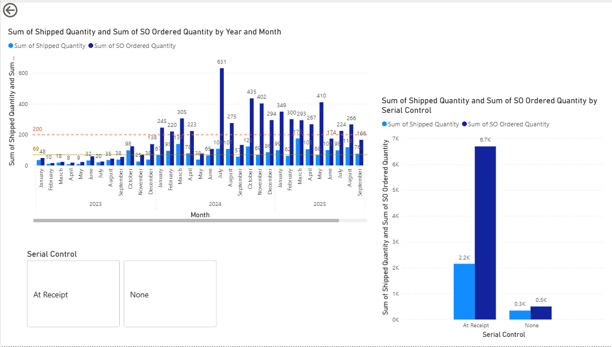
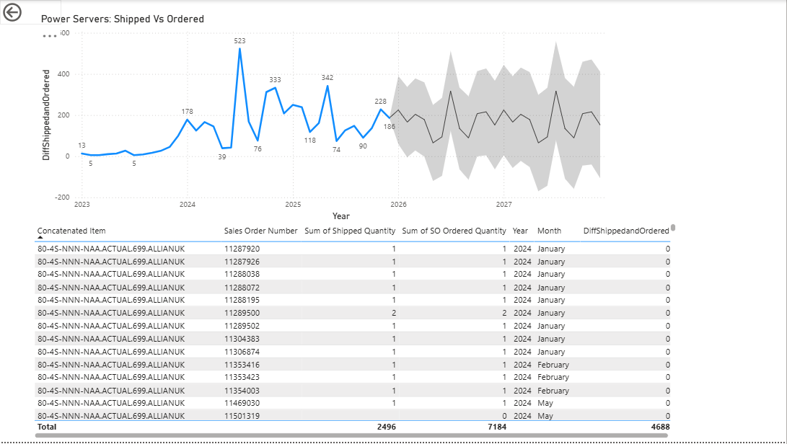
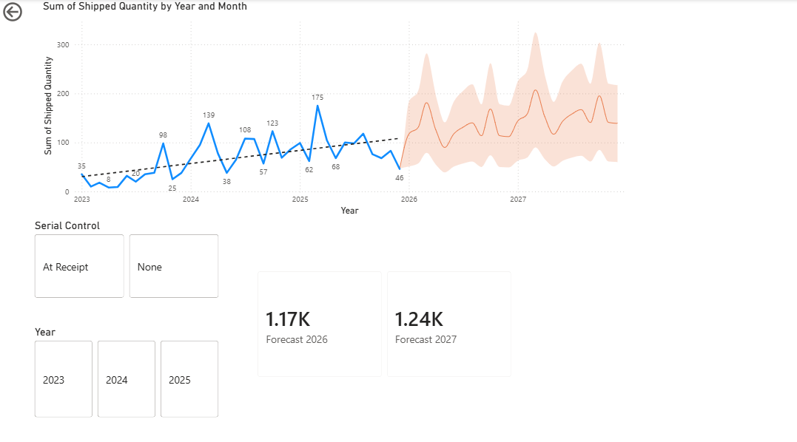

<h1>🖥️ Power Servers — Shipment & Order Analysis Dashboard</h1>

A business intelligence report built in **Microsoft Power BI** that provides a comprehensive three-year analysis of power server shipments and orders. The report combines historical performance tracking with forward-looking forecasting and serial control requirement comparisons to support procurement and supply chain decision-making.

---

## 📋 Overview

| Detail | Description |
|--------|-------------|
| **Tool** | Microsoft Power BI |
| **File** | `Power servers.pbix` |
| **Data Scope** | 3 years of historical shipment and order data |
| **Focus Areas** | Shipments, orders, forecasting, serial control compliance |

---

## 🖼️ Dashboard Preview

### Page 1 — Shipped vs. Ordered by Month & Serial Control
Monthly bar chart comparing **Shipped Quantity vs. SO Ordered Quantity** across 2023–2025, with a 200-unit reference line. Includes a breakdown by **Serial Control type** (At Receipt vs. None).


### Page 2 — Shipped vs. Ordered Difference & Detail Table
Line chart showing the **difference between shipped and ordered quantities** over time (2023–2025) with a forecast trend through 2027. Includes a granular data table with Sales Order Numbers, quantities, and month-level detail.


### Page 3 — Shipment Forecast (2026–2027)
Time series of **Sum of Shipped Quantity** from 2023 to 2025 with a **Power BI forecast** projecting into 2026–2027. KPI cards highlight forecast totals: **1.17K (2026)** and **1.24K (2027)**. Filterable by Serial Control and Year.


---

## 📊 Report Sections

### 1. 📦 Shipments & Orders — Historical Analysis
- Three-year trend view of power servers **shipped vs. ordered**
- Period-over-period comparisons to identify growth patterns, gaps, and fulfillment rates
- Breakdown by relevant dimensions (time period, server type, region, or supplier as applicable)

### 2. 🔮 Forecast for Upcoming Years
- Demand forecasting based on historical shipment and order trends
- Projected volumes to support inventory planning and procurement strategy
- Visual comparison of forecasted vs. actual values to assess model accuracy

### 3. 🔢 Serial Control Requirements Comparison
- Integration of serial control data to validate shipment compliance
- Side-by-side comparison of required vs. fulfilled serial control criteria
- Helps identify gaps between what was ordered, what was shipped, and what met control requirements

---

## 🛠️ Tools & Features Used

| Feature | Description |
|---------|-------------|
| **Power BI Desktop** | Report design and data modeling |
| **DAX Measures** | Custom KPIs, rates, and calculated metrics |
| **Time Intelligence** | Year-over-year and period-over-period calculations |
| **Forecasting** | Built-in Power BI forecast analytics on time series visuals |
| **Slicers & Filters** | Interactive filtering by time period and category |
| **Drill-through** | Detailed views per server or order group |

---

## 📁 Project Structure

```
power-servers-dashboard/
│
├── Power servers.pbix          # Main Power BI report file
├── powerbiPwrServers1.png      # Dashboard screenshot — Page 1
├── powerbiPwrServers2.png      # Dashboard screenshot — Page 2
├── powerbiPwrServers3.png      # Dashboard screenshot — Page 3
└── README.md
```

---

## 🚀 Getting Started

### Prerequisites

- [Microsoft Power BI Desktop](https://powerbi.microsoft.com/desktop/) (free download)

### Opening the Report

1. Clone or download this repository
2. Open **Power BI Desktop**
3. Go to **File → Open report** and select `Power servers.pbix`
4. If the data source paths have changed, go to **Home → Transform data → Data source settings** and update the paths accordingly

> **Note:** If the report is 
